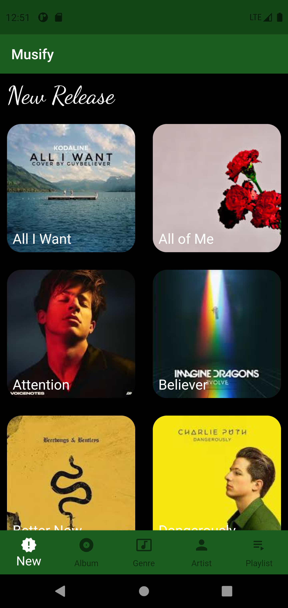

# Musify
<!-- <p>
  
</p> -->

Musify is flutter and firebase based Music player.


### Technology Stack
[](https://flutter.dev/docs)
[](https://developer.android.com/studio "Android studio")


### Screenshots
<table>
  <tr>
    <td><b>Albums Page</b></td>
    <td><b>Artist Page</b></td>
    <td><b>Genre Page</b></td>
  </tr>  
<tr>
    <td></td>
    <td></td>
    <td></td>
  </tr>  
  <tr>
    <td><b>New Release Page</b></td>
     <td><b>List of Music</b></td>
     <td><b>Music Player</b></td>
  </tr> 
  <tr>
    <td></td>
    <td></td>
    <td></td>
  </tr> 
</table>


### Installation

```sh
$ cd Musify-main
$ flutter run
```


### Getting Started

For help getting started with Flutter, view our online
[documentation](http://flutter.io/).

For help on editing plugin code, view the [documentation](https://flutter.io/platform-plugins/#edit-code).


### Show some :heart: and star the repo to support the project
